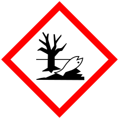

# Potassium Bromate (KBrO3)
## Goal
Investigation of different conditions for the electrolysis of potassium bromide to potassium bromate.

## To-Do
- [x] run until electrolyte becomes saturated, observe if it can be recycled and how it affects the yield
- [ ] try different cell designs to increase batch size, current density and rate of reaction
- [ ] test a number of different electrodes
- [ ] test other additives

## Theory
__Anodic oxidation:__ 2 Br- → Br2 + 2 e-\
__Cathodic reduction:__ 2 H2O + 2 e- → H2 + 2 OH-

Bromine reacts with hydroxide to form hypobromite, which then disproportionates into bromate and bromide:\
Br2 + OH- → BrO- + Br- + H+\
3 BrO- → BrO3- + 2 Br-

__Overall reaction:__ Br- + 3 H2O → BrO3- + 3 H2

## Reagents and Products
### Potassium Bromide
Formula: KBr\
Mol. mass: 119.01 g/mol\
\
__Warning__

* H319: Causes serious eye irritation 

### Potassium Dichromate
Formula: K2Cr2O7\
Mol. mass: 294.19 g/mol\

\
__Danger__

* H272: May intensify fire; oxidizer
* H301: Toxic if swallowed
* H312: Harmful in contact with skin
* H314: Causes severe skin burns and eye damage
* H317: May cause an allergic skin reaction 
* H330: Fatal if inhaled
* H334: May cause allergy or asthma symptoms or breathing difficulties if inhaled 
* H335: May cause respiratory irritation 
* H340: May cause genetic defects
* H350: May cause cancer
* H360FD: May damage fertility or the unborn child
* H372: Causes damage to organs through prolonged or repeated exposure
* H400: Very toxic to aquatic life
* H410: Very toxic to aquatic life with long-lasting effects

### Potassium Bromate
Formula: KBrO3\
Mol. mass: 167.01 g/mol\

\
__Danger__

* H271: May cause fire or explosion; strong oxidizer
* H301: Toxic if swallowed
* H350: May cause cancer

## Experimental
### Run #1
Potassium bromide (47.60 g, 400.0 mmol) and potassium dichromate (0.25 g, 0.85 mmol) were dissolved under stirring in 200 mL deionized water in a 250 mL beaker used as an undivided cell. Platinized titanium (0.25 µm) served as the anode, stainless steel (V2A) as the cathode - both in the form of 8 mm rods submersed about 4.5 cm in the solution (11.56 cm2) 40 mm apart. A constant current of 2.89 A (250 mA/cm2) at initially 5.8 V was run through the solution, while the electrolyte was stirred at 250 RPM. The temperature increased to around 53 °C during this time, while the voltage dropped to 4.9 V. Vigourous bubbling was observed at the cathode, and slight bubbling at the anode.

After 3.5 h corrosion had appeared above the solution on the cathode and had contaminated the electrolyte. A titanium cathode was swapped in place, the solution filtered while hot and the electrolysis resumed. After 6 h a marked increase of oxygen formation at the anode had been noted and the cell left to run over night. In the morning crystals had appeared in the beaker which approx. doubled in volume after cooling to room temperature. Electrolysis was interrupted after 12 h and resumed in the afternoon at 8.3 V with the intention of shutting down the cell after 6 faradays had passed (22 h 15 min). It was accidentally run for 1 h longer, and when it was stopped the liquid had taken on a brighter shade of yellow. During the cleanup it was noticed that the POM-C lid had been attacked by the solution and had even cracked in two places. There were also two small brown spots on the anode that were assumed to be damage incured when the crust was removed from the upper part of the rod.

The resulting suspension was cooled in the refrigerator and the precipitate filtered off by gravity filtration, washed with 100 mL of cold water in several portions and dried in the dessicator. Yield of crude product: 48.35 g (72 % of theoretical 66.8 g). The wash water was combined with the electrolyte for future runs.

### Run #2
Some parameters were amended as follows for the second experiment: The titanium cathode was used from the beginning, and the KBr was dissolved in 200 mL of the mixture of the previously used electrolyte and washings. The suspended KBr had to be heated to ~35 °C on the hotplate to force dissolution. First crystals were observed after approx. 3:50 h and the electrolysis stopped after 6 F had passed. Workup completed the same as before. More discolored spots were observed on the anode that didn't seem to affect the reaction. Yield of crude product: 57,85 g (86.6 % of theoretical 66.8 g).

### Recrystalisation #1
105.90 g crude product was dissolved in 236 mL boiling water, filtered hot and slowly cooled down for recrystallisation. The crystalized mass from the filter was redissolved in 30 mL hot water, filtered, and the filtrates combined. Yield after cooling in the refrigerator, vacuum filtration and drying in a desiccator: 90.70 g (85.6 % of theory). The remaining filtrate was concentrated by boiling until a fair amount of crystals had deposited. The resulting slurry was then combined with the electrolyte from the previous runs.

### Run #3
Same parameters as Run #2: 47.60 g KBr, 200 mL of the electrolyte from previous runs (now saturated with KBrO3), 2.89 A constant current (250 mA/cm2). The electrolyte now had to be heated to 50 °C to insure dissolution of all the KBr.

## Conclusions
### Cathode
* Steel works, but will eventually corrode above the surface of the electrolyte
* Titanium works

### Anode
* Platinum works

### Electrolyte
The electrolyte can be recycled multiple times, and doing so increases the yield because it eventually becomes saturated with KBrO3. After the first run it was considered to increase the concentration of the KBr, though after the third run a 2 M solution proved to be ideal, because more would probably not go into solution at the temperature the cell runs at. An increased initial concentration of KBr might work if the voltage were increased.

## References
