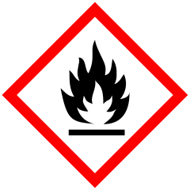
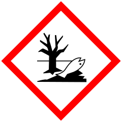

# 2-Iodopropane (Isopropyl Iodide)
__Status:__  Completed
## Goal
Making 2-iodopropane from isopropanol, red phosphorus and iodine.

## To-Do
none

## Theory
Red phosphorus reacts with iodine to form phosphorus triiodide.

3 I2 + 2 P → 2 PI3

This reacts with the alcohol in three consecutive steps to form triisopropyl phosphite and hydrogen iodide.

3 iPrOH + PI3 → (iPrO)3P + 3 HI

The hydrogen iodide displaces the oxygen on the alkyl ester, forming the target compound and phosphorous acid.

(iPrO)3P + 3 HI → 3 iPrI + H3PO3

## Reagents and Products
### Isopropanol
CAS: 67-63-0\
Formula: C3H8O\
Mol. mass: 60.1 g/mol\

\
__Danger__

* H225: Highly flammable liquid and vapour.
* H319: Causes serious eye irritation.
* H336: May cause drowsiness or dizziness.
 

### Iodine
CAS: 7553-56-2\
Formula: I2\
Mol. mass: 253.81 g/mol\

\
__Danger__

* H312+H332: Harmful in contact with skin or if inhaled.
* H315: Causes skin irritation.
* H319: Causes serious eye irritation.
* H335: May cause respiratory irritation.
* H372: Causes damage to organs through prolonged or repeated exposure. (thyroid, oral)
* H400: Very toxic to aquatic life.

### Red Phosphorus
CAS: 7723-14-0\
Formula: P\
Mol. mass: 30.97 g/mol\
\
__Danger__

* H228: Flammable solid.
* H412: Harmful to aquatic life with long-lasting effects.

### 2-Iodopropane
CAS: 75-30-9\
Formula: C3H8I\
Mol. mass: 169.99 g/mol\

\
__Warning__

* H226: Flammable liquid and vapour.
* H315: Causes skin irritation.
* H319: Causes serious eye irritation.
* H335: May cause respiratory irritation.

## Experimental
A 100 mL round bottom flask equipped with a condenser was charged with boiling stones, 24.05 g (400 mmol, 1 eq.) absolute IPA (dried over 3 Å molecular sieves) and 4.15 g red phosphorus (133 mmol, 0.33 eq.). After bringing the contents of the RBF to reflux 50.75 g iodine (200 mmol, 0.5 eq.) was added through the condenser in small portions, such that the colorless vapours released by the mixture stayed in the lower part of the condenser. After approx. ⅓ of the iodine had been added, the rate of addition could slowly be increased and the addition completed after 1:30 h, although some acidic vapour did escape the apparatus. The condenser was equipped with a drying tube and the dark reaction mixture left to boil for another 60 min.

After cooling to room temperature the product was distilled from the reaction mixture (77–87 °C, a significant amount of unreacted phosphorus remained behind) as a malodorous, milky, orange liquid and was stored in the refrigerator over night. It was washed with 3 × 10 mL water until the solution cleared up, dried over MgSO4 and redistilled (87–88 °C, lit. 89 °C), whereupon a colorless liquid smelling of halogenated solvents was obtained. The 2-iodopropane was stored in a amber glass bottle over silver foil.

## Results
Yield: 52.65 g (77 % of theoretical 68.00 g, lit. 80 %).

## References
Beckert, Rainer; Fanghänel, Egon; Habicher, Wolf D.; Knölker, Hans-Joachim; Metz, Peter; Schwetlick, Klaus (2015): Organikum. Organisch-chemisches Grundpraktikum. With assistance of Heinz G. O. Becker. 24th Ed. Weinheim: Wiley-VCH Verlag. p. 233.
